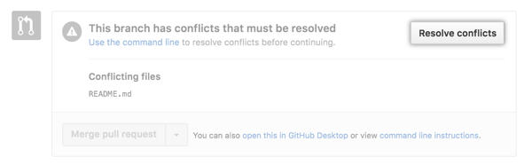
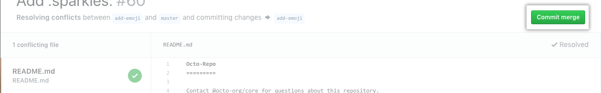

SRC Folder Breakdown

The following is an analysis of all the files and folders in
the root of the SRC directory.

-------------------------------------------------------------

- The first sub-folder in SRC is the DOC folder, short for
  Documentation.  Simply put, this folder is where you put
  all files related to the documentation of the template.
- The second sub-folder is the IMG folder, which is short for
  image.  As you may have guess, any assets having to do with
  images are stored here.
- The final sub-folder we have in SRC is JS, which stands for 
  JavaScript.  This is where all JavaScript files and assets 
  are stored.
- The first file we have in src is .EditorConfig.  This file
  is used to maintain consistent text formatting in collaborative
  projects.  The file is simply a list of settings to be used 
  by each coder's IDE.
- The next file we have is the .GitAttributes file.  This file
  is created and used by the Git VCS.  This file lists off if
  each file extension in the project will be converted to a 
  text format or left as binary.
- Next we have the .GitIgnore file.  This is another file used
  by Git.  As the name would suggest, the .GitIgnore file lists
  the files and/or directories that are to be left untracked
  by Git.  Useful if you have a todo list or other non-critical
  files.
- The next file we have is the first one that is used in the actual
  web template.  404.html is a standard 404 page, used when a user 
  tries to access a page that doesn't exist (usually as a result of
  broken links).
- BrowserConfig.xml is a file that's only used under certain 
  circumstances, specifically if the page is accessed using 
  Internet Explorer 11 running on Windows 8.  In that case it
  is used to create the background images and colors of the page
  but is otherwise optional.
- FavIcon.ico has two traditional uses.  The first is as the 
  small icon that appears next to the site in your bookmarks 
  list.  The second use is almost identical, except that instead
  of appearing in your bookmarks list it appears in the address bar/tab 
  header of your browser.
- Humans.txt is a short file designed to give proper credits to
  the team responsible for the project.  All they need to do is 
  put their names and roles in the file.
- Icon.png is a slightly larger version of favicon.ico, and is 
  used as the Apple Touch Icon in the event that the program 
  becomes an app.  This would be the icon you tap to start the
  app.
- Index.html is the default landing page for the website, and 
  most likely the first page the user will see.  A more detailed
  explanation of this file will be included in the next section.
- Robots.txt is used in regards to webcrawlers from search engines
  like Google.  Specifically it is used to determine whether
  certain pages of the website are allowed to be index by crawlers,
  or if the crawlers are disallowed from doing so.
- Site.WebManifest is a short manifest of the contents of the
  website stored as a .JSON file.  The main things stored in 
  the file are the name, author, icon, and description.
- Tile.png is similar to Icon.png, but instead of being used 
  as a touch icon for an app, it is used as the icon when you
  pin the program in a Windows environment.
- Tile-wide.png is virtually identical in purpose to the prior
  file, the only functional difference being a higher resolution.
  This one is used for the "windows" display in Windows 10.
  
--------------------------------------------------------------

Index.html Breakdown

This section will go over each line of the index.html page.

-------------------------------------------------------------

Line 1:

- This line is referred to as a doctype declaration, which is
  effectively a set of instructions given to the browser to let
  it know what version of html must be used.

Line 2:

- This line opens the HTML tag, which the entire page will be 
  enclosed in.  This tag allows for certain variables to be set,
  such as 'no-js.'
- This code is used for interfacing with Modernizr, a JS plugin
  for browsers.  If Modernizr is running, it replaces the 'no-js'
  with 'js,' allowing JavaScript to be run.
  
Line 4:

- This line opens a Head tag, which is the place to store meta-
data and declare any links to external files.

Line 5:

- This is an example of a meta-data tag, which allows for many
  different options to be set.
- This line sets the encoding system to UTF-8, which is the 
  preferred encoding scheme for online applications.  Encoding
  in this case refers to how the data is encoded into binary.
- It's very important to declare this as soon as possible in
  this file, otherwise you're vulnerable to data breaches and 
  hijacking due to unencoded data being left vulnerable.
- UTF-8 is the modern equivelant of the ASCII encoding scheme,
  and is fully backwards-compatible with ASCII.  It is also very
  widely used and thus encoding a website in UTF-8 ensures maximum
  compatibility.

Line 6:

- This meta-data tag is enabling another option, more
  specifically enabling support for older versions of 
  Internet Explorer.  The line "ie=edge" will tell Internet
  Explorer to display the page in the most recent IE format
  It can support, usually IE9.
  
Line 7:

- This line open and closes an empty title tag.  Title tags
  are used to display the name of the website/web page in the
  tab of the browser.
  
Line 8:

- This line establishes the page's meta-description information,
  which is often used in search engine results.  The only time
  this description is seen by a user is as the description of
  the web page when it appears as a result of a search.  If
  this is left blank, the search result description will be
  taken from the first paragraph of the page.
  
Line 9:

- This line is called the viewport meta-tag, and is used to 
  help scale a website down to fit on a mobile device screen.
  A manual width can be set, or the width can be set to match
  the device's screen.  An optional scaling factor can be set
  to further adjust the mobile display.
  
Line 11:

- This is an example of a link tag.  The 'rel' field determines
  how that document relates to the current one, and the 'href'
  field denotes the url or filepath for that document.
- In this case, the tag is denoting that the specified file
  is this page's manifest file.
  
Line 12:

- This line specifies what image is the app's Touch Icon,
  which we covered earlier.
  
Line 13:

- This line is an example of a comment.  Comments are not
  read or executed when the rest of the code runs and usually
  serve to exist as notations on an app's code for other
  programmers to read.
  
Line 15:

- This is a link to an external style sheet that will be used
  to format the web page. Using external style sheets is considered
  good practice since you only need to change one file instead of
  every linked page.
  
Line 16:

- This is another link to an external style sheet.  Multiple
  style sheets can be utilized to pull off different effects.

Line 17: 
- This line closes the previously opened head tag, making sure
  that anything past this point is not treated as part of the 
  head tag.  Always close your tags.

Line 19:

- This line opens a body tag, which is where the bulk of all
  your html code will go.  This tag is much more tangible than
  the head tag, as almost everything in the body tag will be
  viewable in the final product.
  
Line 20:

- This comment appears to be designed to interface with Modernizr,
  specifically the browser detection feature.  This line will
  execute if modernizr detects that the user is using an old
  version of Internet Explorer and display a message suggesting
  an upgrade.

Line 21:

- This line begins with a paragraph tag, configured to the
  type of "browserupgrade."  Most HTML tags can be set to sub-
  types in order to alter their behavior in some way.
- This line continues with plain text that spells out the 
  desired message.  Within this line of plain text are formatting
  tags, such as < strong > to indicate boldface.
- This line also has an integrated hyperlink to redirect the 
  user to another webpage if they click on it.
  
Line 22:

- This line appears to close the if statement that was opened
  in the previous comment.

Line 24:

- This comment exists to give instruction on how to modify 
  it for the programmer's use.
  
Line 25:

- This is another paragraph tag with more plain text.

Line 26:

- This is an example of a script tag.  Instead of writing JavaScript
  in the HTML file, you can link an external JavaScript file
  instead.  This is the recommended method.  The SRC field is used
  to denote the location of the external JS file.
- This JS tag is calling the main JS file for Modernizr.  At
  this point when the code is executed, the linked file will be
  called and carry out its function, so be sure to place your
  JS tags after the code you want it to work on--or, ideally, at
  the end of the entire file.
  
Line 27:

- This Script tag is linked to an external JQuery website for
  added functionality.  The "integrity" and "crossorigin" fields
  are added security measures.  Integrity is denoted to specify
  what protocol to go with if the original source of this script
  has been manipulated in some way, and likewise the crossorigin
  is used to specify what to do when the source file is hosted
  on a different server.
  
Line 28:

- This script tag is an example of an in-line JavaScript code.
  Functionally this will work just as fine as calling an external
  file.
- This is a particularly interesting JavaScript line because
  it's calling a JQuery function in the current window, which
  also calls and executes a second JQuery function.
  
Line 29&30:

- These two lines link additional JS files from the JS folder
  in this project.
  
Line 32:

- This is another comment with instructions for the programmer.

Line 33:

- This line opens a Script tag.  The following lines are another
  way to do in-line JS.
  
Line 34&35:

- These lines are actual JS code, which has entirely different
  formatting and syntax than html.  These two lines contain
  multiple JS statements separated by ;
- What these lines do is prepare and send a Google Analytics
  tracker with information about your website.  This is a very
  good tool to track various post-production and usage statistics
  about your website.
  
Line 36:

- This line closes the previous Script tag, an important step.

Line 37:

- This is another Script tag, but with the inclusion of Async
  and Defer, it will run after the entire web page has been loaded
  and will even effect the lines below it.

Line 38:

- Closes the body tag.  You'd get serious errors without this.

Line 40:

- Closes the html tag, ending the file.
  You'd get serious errors without this.
  
------------------------------------------------------------
1.	1958: Bell Labs creates the modem
2.	1969: Arpanet is founded.
a.	 Arpanet was a military computer network that was used for sharing data long distance. It was developed under ARPA and soon linked four different universities computers together. ARPANET would send information by using packets. The basis for the internet can be traced back to ARPANET
3.	1971: Ray Tomlinson sends the first network email
a.	  Ray Tomlinson sent the first email using a software called “SNDMSG.” He also introduced the “@” symbol to separate the person name and location. Tomlinson sent the first email to a colleague in the same room as him, to check if the software was working properly. To this day, the message within the email has been forgotten. 
4.	1974: TCP/IP ideas are introduced in a protocol for packet network intercommunication.
a.	  Vinton Cerf and Robert Kahn published A Protocol for Packet Network Intercommunication. Because many of the existing computers operated on its on hardware and software, it became almost impossible for computers to commutate to each other. Cerf and Kahn created a protocol, TCP, that allowed cross networking. They published their network architecture in May of 1974. 
5.	1974: the word Internet is coined
a.	  In Internet Transmission Control Program, internet is first used in the acronym IP, which stands for Internet Protocol. 
6.	1983: ARPANET adopts TCP/IP 
a.	  ARPANET scientist began to assemble the “network of networks” that became the modern
7.	1984: Domain Name System (DNS) is introduced
a.	  Paul Mockapetris recognized one problem with ARPANET’s problem with translating addresses into a single table on a single host. He introduced DNS and it become a one of the internet standards n the IETF. Some of the DNS include: .com, .gov and .edu. 
8.	1990: HTML language is created. 
a.	  Developed by Tim Berners-Lee, HTML was used to create web pages, that could be displayed on the WWW. Without the creation of HTML, web pages would not be able to correctly display text or images. 
9.	1990: The World Wide Web (WWW) is introduced. 
a.	   Tim Berners-Lee and his team developed the WWW as a way for scientists in universities and institutes around the world to share information. The first ever website is: http://info.cern.ch/
10.	1991:  http://info.cern.ch/
a.	   Tim Berners-Lee publishes the first ever website, http://info.cern.ch/. It describes how the web works and how to use it.
11.	1993: Mosaic is created and becomes the first popular web browser. 
a.	   Marc Andreessen and Eric Bina designed Mosaic for Windows. Funding was provided for the project and the first alpha release was published in June 1993. It was not until September 1993 that the first beta was released. 
12.	1994: WebCrawler is the first full search engine 
a.	   Brian Pinkerton first created WebCrawler at the University of Washington. WebCrawler was only used as a desktop application. In April 1994, the search engine had over 4,000 websites. By November 1994, it hit its one millionth search query. WebCrawler is the oldest surviving search engine and is still in operation. 
13.	1994: Amazon is founded
a.	   Jeff Bezos created Amazon in July of 1994. It original started as an online bookstore. The company is now worth ~$1 trillion. 
14.	1995: DOT-COM BOOM BEGINS
15.	1995: Apache is created 
a.	   In 1994, Brian Behlendorf and Cliff Skolnick created a group of developers to create Apache. After testing out the many enhancements and bug fixes to the NCSA base, they released their owned server, Apache, was released in April 1995. It became the most widely server. It is free to use and download. 
16.	1995: Java is created
a.	   James Gosling, Mike Sheridan, and Patrick Naughton started working on the java project in 1991 and was initially used for television. It was released in 1995 under Sun Microsystems Java platform. Java was a key component in the internet. Java code was designed to have less implementation dependencies and to run on all platforms that supported Java. 
17.	1995: eBay is founded
a.	   Pierre Omidyar founded eBay, then called AutionWeb, on September 3, 1997. The first item to go up for sell was a broken laser pointer. It was purchased for $14.83. It is now estimated to be worth ~$10.5 billion
18.	1998: Google is founded
a.	   Larry Page and Sergey Brin created google while students at Stanford University. They wanted to create a search engine that would analyzed the relationships among different webpages called PageRank. It determined the relevance of a webpage by how many times the webpage was linked. In September of 1997, Google was registered as a domain name. It was officially incorporated September 1998. 
19.	2000: Wi-Fi is trademarked 
20.	2001: Wikipedia is created
a.	   Created by Jimmy Wales and Larry Sanger, Wikipedia become the largest reference webpage in history. It has over 5 million articles and is comprised of over 300 languages. 
21.	2002: DOT-COM BOOM ENDS
22.	2004: Facebook is created
a.	    Founded by Mark Zuckerberg and several other roommates, Facebook started out as a website for only Harvard students. It eventually grew to other colleges/universities such as Yale and Columbia. Facebook eventually opened to everyone at least 13 years of age and had an email. As of January 2019, Facebook has 1.74 billion users around the world. 
23.	2005: YouTube and Reddit are now available online
24.	2006: Twitter Launches
a.	    Founder of Twitter, Jack Dorsey sends out the first twit on March 21, 2006
25.	2011: Number of Internet users reaches 2 billion 
26.	2012: Ecommerce sales reach $1 trillion worldwide
27.	2013: The majority of American Adults use online banking.
28.	2018: Number of internet users reach 3.9 billion

-------------------------------------------------------------

GitHub Tutorial

Vocabulary

GIT - Git is a free and open source distributed version control system designed to handle everything from small to very 
large projects with speed and efficiency.

GITHUB - GitHub is a Git repository hosting service, but with many new tools added to make collaboration much easier than
with standalone Git.

Repository - a central location in which data is stored and managed; in our case, a repository is the digital copy of our
project that is stored on GitHub that we work off of.

Clone -  Making a local copy of a hosted repository on our local machines.

Commit - saving changes made to the project and preparing them to be pushed to the repository.

Push - refers to the command we use when we send our committed version of the project back to the repository for review.

Pull - updating our local project with the most recent commits from the repository.  Doing this also updates the files in
our working environment.

Branch - branches are different versions of the same project that are being worked on separately.  Every project has at 
least a master branch, which is the main version of the project.  Each team member should ideally be working out of their
own unique branch so as not to cause conflicts and chaos while the team works.

Merge - refers to the act of combining branches into each other.  Merging branches adds all of the unique files from each
branch into a single copy.  However, if there is a file in both branches that has the same name but different contents, 
attempting a merge will result in a...

Merge Conflict - the result of attempting to merge branches that have at least one file that has contradictory contents 
between both branches.  This requires a manual resolution to the conflict, which will be covered in this guide.

Fetch - similar to a pull in that it updates local files, but unlike a pull it does not update the files in our working
environment

Remote - refers to a web-hosted repository.

Collaboration Tutorial

Prerequisites:

- A GitHub account.

- a local installation of Git.

- a local installation of Webstorm.

Once you have all of the above, it's time to learn how to collaborate on GitHub.

Step 1.

The first step in working on a collaborative project on GitHub is to have a repository you want to work out of.  If 
you do not have one, making one is very simple.  From your GitHub dashboard, find and click on the green "New" button.

This will take you to a page where you need to give your new repository a name, plus an optional description, determine 
if it will be publicly or privately viewable, initialize it with a readme and/or a GitIgnore, and pick a license for your
project.  For the purposes of this example make sure you add a readme, then press the green button at the bottom of this 
screen.

Step 2.

Now we have our repository, but we're still missing one crucial ingredient for collaboration: collaborators.  To add 
collaborators to your project, go to the repository's page and click on the settings tab.  This will open a new screen 
with a sidebar.  On that sidebar is a setting labelled collaborators, click on it.

This opens a new panel where you can see the current collaborators on a project as well as provide you with a searchbox
for looking up your teammates' accounts and adding them to the project.  Type in one username at a time and press the button
to send them an invite.  After the accept, they will be added to your project as a collaborator.

Step 3.

Okay, now we have our collaborators but you may be wondering just how everyone will get a copy of the project's files to
work on.  This is where we will enter Webstorm and begin to do some actual work.  Open up Webstorm and locate the VCS tab
at the very top of the workspace window.  Under that tab, navigate to Git, and under the Git tab navigate to and click on 
Clone.

This will open a small window over your work space with two fields and a few buttons.  The top field is asking for the URL
of the repository you would like to clone, while the second is asking you to specify where to save this cloned repository.
Paste the URL of the repository made during this tutorial and configure the save location to your liking, then press the
clone button.  Depending on the size of the repository cloning could take several minutes.

Step 4.

Before you and your teammates start coding in a flurry and trip over each other, there is one very important step to take
to ensure code sanity: creating individual branches. To create a branch, go to the bottom right corner of webstorm and 
look for a tab that says "Git:master." Click on it, and the branch window will appear.

For the time being we're just interested in one option, New Branch, but we will come back to this menu later.  Click on 
New Branch and communicate with your team so all members have a uniquely named branch.  As a side note, to switch between
your active branch, go back to this menu, click on the local branch you would like to work in and select the Checkout option.

Step 5.

Once you're done making changes to your local branch and want to update the repository with your work, it's time to commit
your changes and push them back to the repository.  To do this, we need to find the Commit button in order to save our work.
This button is located in two places: in the top right corner of the webstorm window, and under the VCS menu.  Both buttons 
will accomplish the same effect.

The Commit button acts similarly to saving, meaning you don't need to perform a regular save after a commit, but it also
prepares your code to be pushed to the repository.  That's why when you press on this button one of the things you'll see
is a textbox where you should write a short, descriptive message explaning your changes.  After writing a message just
press the commit button at the bottom of this window.  Now, we need to actually push the code back to the repository.  This
button is, once again, located under VCS -> Git -> Push.  Clicking on it will open this window.

The bulk of this window is taken up but two review panels.  The first one allows you to review which commits you're about
to push, and the second one shows you the status of certain files in the project.  Only the files that have been changed, 
added, removed, etc since the last pushed commit are shown, with new files being highlighted green, removed files being 
greyed out, and edited files being blue.  After making sure you're pushing everything you want to, go ahead and push the
commit button to send your work to the repository.  This will create a new section of the repository for your branch, 
assuming you've been working on one.

Step 6.

One thing you might notice after a few commits by your team is that your local files don't automatically update after every
commit to the repository.  In order to update your local files, you need to Pull from the repository.  In order to do this,
just locate the Pull button located next to the Commit button in the top right, or under the VCS -> Git menus.  Either way,
this will open a small dialogue box.

None of these options are particularly important to us, so just go ahead and hit the OK button.  If you end up working on 
a project with more specific requirements, those options may come in handy, but for now just hit ok and let your files 
update.  Once that finishes, your local copy of the project will be up to date.

Step 7. 

But wait, you might be saying, my work space didn't update at all!  While that may appear to be true, click on the branch
manager tab again.  If your teammates added their own branches, you'll see them added under the remote branches section.
How do you get them into your workspace?  Simple.  Click on that tab again, then on whatever remote branch you don't already
have in your workspace, then click on Checkout As...

This will present you with the option to either rename the branch or leave it with its original name.  I recommend leaving
it with the default name.  After creating the new copy of that branch, checkout into that branch and you will see all the
files and edits made in that branch.  These branches are separate from each other so you can work in your own branch while
using files in other branches as references.  Additionally, you can merge local branches into each other.  To do this, 
simply checkout the branch you would like to merge into, then click on the branches you would like to merge and click on 
"merge into current."  This will combine the two branches so you have the files of both.

Step 8.

The final thing that you may notice while collaborating is that the master branch doesn't seem to update and pushing into
the master branch isn't working.  That's simply because you can't push into master, and there's a specific process to update
the contents of master.  On the project's GitHub page, you will see a button labelled "New Pull Request".  Click on it, 
and after being prompted to select a branch you will be taken to a new screen.

This screen can be broken up into 3 major sections.  The first section asks you to write a description for your pull 
request and also features the button to confirm your pull request.  Additionally the top of this section will show you 
the compatibility between the two branches.

The second section allows you to review every previous commit from the branch you are merging.  Useful for deciding if 
the branch fits all requirements you are looking for.

And lastly, the final section allows you to see any and all changes made to files shared between branches in full detail.

Sometimes, like in the example images featured above, a pull request will be able to merge automatically without issue, 
but most of the time your pull requests will not go over so smoothly  and you will need to manually resolve merging conflicts.

This message will appear after creating a pull request that has merge conflicts.  Scrolling down on the same page where you
create the request will show you a breakdown of the merge conflicts between branches.  Click "Resolve Conflicts" to be taken
to the next page.

This new page is a more in-depth look at the conflicts between each branch, and uses special tags to denote the beginning,
end, and separate branches in the merge.  The conflict block begins with a <<<<<<< tag, separates the branches with a =======
tag, and ends with a >>>>>>> tag.  The idea here is to manually replace or merge the conflicting segments for each conflict
block, and to erase the conflict tags afterwards.  When dealing with text flies you can be a bit more lax and loose with
how you merge, but when it comes down to resolving merge conflicts between code you must be extremely careful to not accidentally
break the entire project by accidentally deleting critical segments of code.  Once you are done with the first file, click
on the "mark as merged" button at the top of this screen, and look to the sidebar to see if there are any other files that
need your attention.

Repeat this process until all files have been resolved, at which point you will be asked to confirm your changes and will
then be able to complete the pull request as usual.
